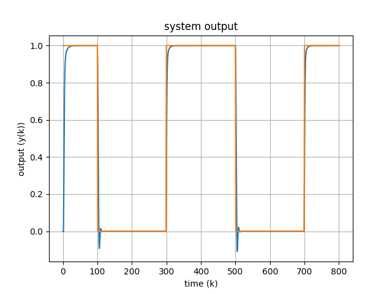

# MFAC
<a></a>
<a></a>
<a></a>
<a></a>
<p align="center">
  
</p>
Model Free Adaptive Control Toolbox for Python

This project aims to provide a simple and fast python package for model-free adaptive control. The package includes compact form dynamic linearization (CFDL), partial form dynamic linearization (PFDL) and full form dynamic linearization (FFDL) model free adaptive control methods both for SISO and MIMO systems.

## Installation
You can easily install MFAC Toolbox from PyPI:
```
pip install MFAC
```

## Simple Example
The following code shows the functionality of MFAC Toolbox in controlling a simple SISO system using CFDL method from (`\examples\siso_cfdl_simple.py`):

```python
import numpy as np
import matplotlib.pyplot as plt
from mfac.plants.siso import Model1
from mfac.controllers import CompactFormDynamicLinearization

# define the model and set the initial values
model = Model1(initial_state=np.array([0]))

# Simulation conditions
total_time = 8
step_time = 0.01

# Desired output (y_desire)
y_d = np.zeros(int(total_time / step_time) + 1)
for k in range(int(total_time / step_time) + 1):
    y_d[k] = 0.5 + 0.5*np.power(-1, np.round(k/200))

# log function which will be ran after each iteration
def log_function(cfdl):
    print('iteration: ', cfdl.iteration)

# define the controller
controller = CompactFormDynamicLinearization(model=model,
                                             iteration_function=log_function,
                                             time_step=step_time,
                                             reference_output=y_d,
                                             simulation_time=total_time,
                                             labda=1,
                                             eta=1,
                                             mu=1,
                                             rho=0.45,
                                             )

# run the simulation
controller.run()

# plot the output
fig, ax = plt.subplots()
ax.plot(model.Y)
ax.plot(y_d)
ax.set(xlabel='time (t)', ylabel='output (y)',
       title='system output')
ax.grid()
# fig.savefig("test.png")
plt.show()
```
the output will be like:  

  
# Components
To control a system using the current MFAC library, two major components are required; model and controller.
## Model
A model is simply a class with the following structure:

|    Part    |                                                                            Variables/Methods                                                                            |                                                                                                                                                                                             Description                                                                                                                                                                                             |
|:----------:|:-----------------------------------------------------------------------------------------------------------------------------------------------------------------------:|:---------------------------------------------------------------------------------------------------------------------------------------------------------------------------------------------------------------------------------------------------------------------------------------------------------------------------------------------------------------------------------------------------:|
| Input      |                                                                          Initial_state (array)                                                                          |                                                                                                                                                                            Initial position of the plant in state space                                                                                                                                                                             |
| Parameters | number_of_inputs (int)<br>number_of_states (int)<br>number_of_outputs (int)<br>x (array)<br>y (array)<br>u (array)<br>X (array)<br>Y (array)<br>U (array)<br>time (int) |       Number of control inputs<br>Number of state parameters<br>Number of outputs<br>The current state of the system<br>The current output of the system<br>Current input control of the system<br>States of the system during the simulation<br>Outputs of the system during the simulation<br>Controls of the system during the simulation<br>The current time of the simulation (discrete)       |
| Functions  |                                                         reset()<br>step()<br>observe()<br>render()<br>predict()                                                         | Resets the plant for the next simulation<br>Gets the input controller and moves one step forward, returns the output<br>Observes the system's state or output variable defined by `full_state` input parameter<br>Renders the system based on input parameter `mode` which can be `print`, `plot`, or `visual`<br>Gets a series of inputs (k future steps) and predicts the systems state or output |

## Controller
A controller is simply a class with the following structure:

|    Part    |                                                                        Variables/Methods                                                                         |                                                                                                                     Description                                                                                                                      |
|:----------:|:----------------------------------------------------------------------------------------------------------------------------------------------------------------:|:----------------------------------------------------------------------------------------------------------------------------------------------------------------------------------------------------------------------------------------------------:|
| Input      | model (Model)<br>iteration_function (Function)<br>reference_output (array)<br>simulation_time (int)<br>time_step (Float)<br>mimo (Boolean)<br>Control parameters | The plant to be controlled<br>The function which will be called in each step<br>The desired output<br>Simulation duration in seconds<br>Timestep for each step<br>The control for using the MIMO form<br>Control parameters for each specific method |
| Parameters |                                                       u (array)<br>fai (array)<br>U (array)<br>Fai (array)                                                       |                                                            The current control input<br>The current fai value<br>Control inputs during the simulation<br>Fai values during the simulation                                                            |
| Functions  |                                                                              run()                                                                               |                                    Runs the simulation based on the time and time step, in each step calles the `model.step()` with the calculated control and calls the `iteration_function` at the end of step                                     |


# Development Status
Currently developed methods:  
- [x] CFDL
- [ ] FFDL
- [ ] PFDL

Currently developed models:
- [x] Simple SISO model 1 (Model1)
- [x] Simple MIMO model 1 (Model1)

Currently tested scenarios:
- [x] CFDL on SISO Model1
- [x] CFDL on MIMO Model1